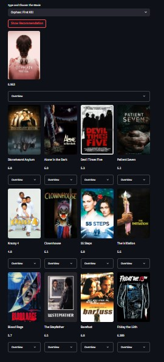

# 🎬 Movie Recommendation App

This is a Streamlit web application that recommends movies to users based on a selected movie. It uses content-based filtering with cosine similarity to suggest the top 5 similar movies and displays their homepage and poster images using TMDb API.

## 🖼 Screenshots

### 🏠 Home Page

### 📊 Example Recommendation Output

## 🔍 Features

- 🎥 Movie recommendations based on similarity
- 🖼 Poster display via TMDb API
- 🔗 Homepage links for recommended movies
- ⚡ Fast performance using precomputed similarity matrix
- 📱 Built with an easy-to-use Streamlit UI

## 📁 Dataset and Files

All required data files for this app (including `movies.csv`, `similarity.pkl`, and others) are available in this Google Drive folder:

📂 **[Download Dataset](https://drive.google.com/drive/folders/1dee_crYzxxuqTw1FmurhMsnDPuV2ddKB?usp=drive_link)**

After downloading, place all the required files in the same directory as `movie_recommendation_app.py`.

## 🛠 Technologies Used

- Python 3.7+
- Pandas
- Scikit-learn
- Streamlit
- Requests
- TMDb API

## 🚀 Getting Started

### 1. Clone the Repository

git clone https://github.com/MoustafaAliAshour/Movie-recommendation-System.git
cd movie-recommendation-app

### 2. Download the Required Files
Download all required files from this folder:
🔗 https://drive.google.com/drive/folders/1dee_crYzxxuqTw1FmurhMsnDPuV2ddKB?usp=drive_link

Make sure the following files are placed in the same folder as the Python app:

movies.csv

similarity.pkl

### 3. Install Dependencies

pip install pandas scikit-learn streamlit requests

### 4. Run the App

streamlit run movie_recommendation_app.py
🔑 TMDb API Key Setup
To fetch movie posters, you need a TMDb API key:

Sign up at TMDb

Go to your account settings → API → Get API Key

Replace "your_api_key" in the script with your actual key:

api_key = "your_actual_tmdb_api_key"

## 🧠 How It Works
Reads movie metadata from movies.csv

Uses cosine similarity (from similarity.pkl) to find the 5 most similar movies

For each recommended movie:

Fetches the poster using TMDb API

Shows its homepage link

## 📌 To-Do
Add user ratings & collaborative filtering

Add genre-based filtering

Host the app publicly via Streamlit Cloud

## 🙋‍♂️ Author
Mostafa Ashour

Feel free to contribute, suggest improvements, or report issues!

